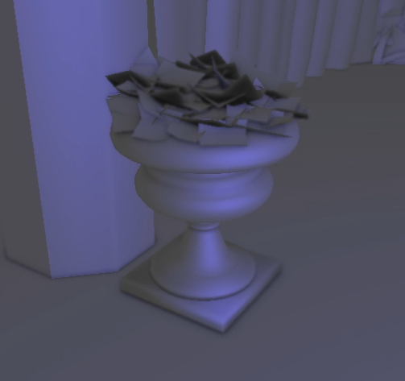
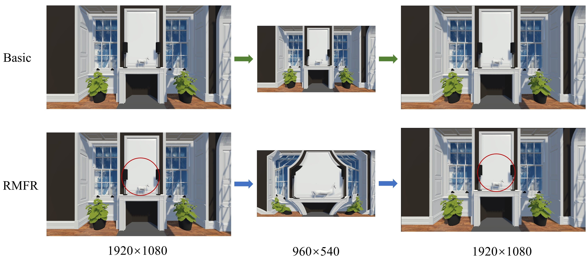
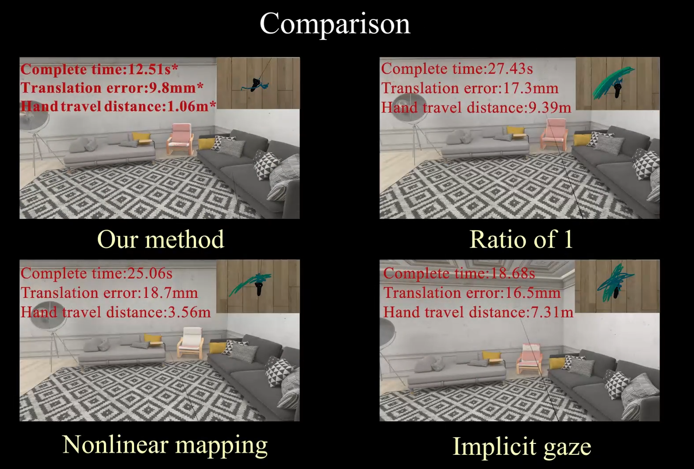

# Personal Portfolio
个人作品展示，持续更新
## 渲染技术
### 01 [仿原神渲染](./GenshinRender)
**工作介绍** 
一直对原神的卡通风格渲染很有兴趣，而且目前已经有很多技术博客，于是尝试自己动手做一个。平台选的是Untiy，因为主流而且熟悉。前期准备主要是模型和贴图，模型好找但是贴图需要一些搜索能力；实际操作上，首先用blender把模型转成带贴图的fbx格式，这样导入Unity不容易丢失纹理，渲染的主要工作就是写URP Shader，基础的效果包括diffuse和Ramp、自发光、边缘光和高光，最开始用Untiy的蓝图去做面部阴影SDF，个人觉得并不好用，换成代码就是几行的事情，目前边缘光和描边还存在一些问题，后续再修复。   
**相关技术** NPR; Unity

### 02 [环境光遮蔽（SSAO）](./SSAO)
**工作介绍** 
跟着LearnOpenGL上的教程学做了SSAO，模型用的是Sponza。环境光遮蔽对渲染真实度的影响还是很明显的，借助这次复现（Debug）熟悉了渲染流程和算法实现。  
**相关技术** SSAO; OpenGL

## 工程项目
### 01 [增强现实飞机装配](./ARAssembly)
**项目介绍** 
为用户提供飞机装配引导。用户佩戴增强现实头盔，通过悬浮面板自由控制飞机装配进度。装配包括软管和刚体两部分，装配动画由脚本自动批量生成。  
**相关技术** MRTK; Unity; Hololens2  

### 02 [混合现实多人协同装配](./MRMutiplayerAssembly)
**项目介绍** 
本项目属于国家自然科学基金重点项目，为面向智能制造的原型应用示范。项目的应用场景为航空飞机装配，工人佩戴增强现实头盔在装配现场工作（左图）;专家佩戴虚拟现实头盔进行远程指导，现场的装配场景通过动态点云设备与远程专家共享（右图）。  
**相关技术**
MRTK; SteamVR; Unity; SLAM; 3D Registration

### 03 [面向交互帧率的凝视点渲染](./fovedRender)
**项目介绍** 
为提高运行帧率的同时保证用户视觉体验，在虚拟现实交互项目中加入凝视点渲染技术，在保留用户关注区域高分辨率的同时降低非关注区域的分辨率。具体工作是在Unity渲染管线中实现基于矩形映射的凝视点渲染(RMFR)<a href="#参考文献">1</a>，并能搭配HMD和眼动仪正常运行。  
**相关技术** Unity SRP; Deferred Shading; Foveated Rendering

### 04 [Litemall微信小商城](./Litemall)
**项目介绍** 
基于 SpringBoot 开发的一个完整的网上商城系统，支持网页和微信访问。项目经历完整生命周期，包括需求分析、模块划分、详细设计、代码开发、软件测试以及部署运维。担任开发小组组长，负责组内工作安排以及文档整理；同时自己也是开发人员，主要负责优惠券(coupon)模块的开发。  
**相关技术**
Springboot; MYSQL; Redis; Nginx; Zuul

## 科研项目
### 01 [基于可变交互区域的VR高效对象操作](./VRManipulation)
**项目介绍** 
在虚拟现实环境中设计一种基于可变交互区域的虚拟对象操作方法，通过构建交互热度图分析用户操作行为并更新交互区域，从而支持多种精度的对象操作，提高用户操作效率，降低操作负担，让操作流程更加自然。  
**相关技术**
Unity；SteamVR；眼动跟踪  

 

## 参考文献

[1]. Ye J, Xie A, Jabbireddy S, et al. Rectangular mapping-based foveated rendering[C]//2022 IEEE Conference on Virtual Reality and 3D User Interfaces (VR). IEEE, 2022: 756-764.
